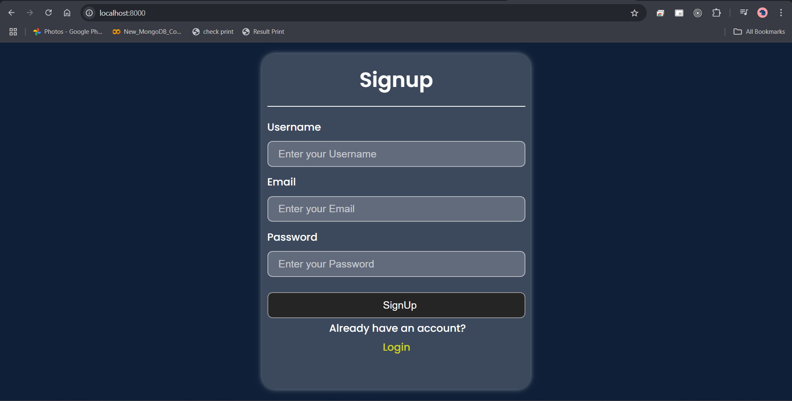
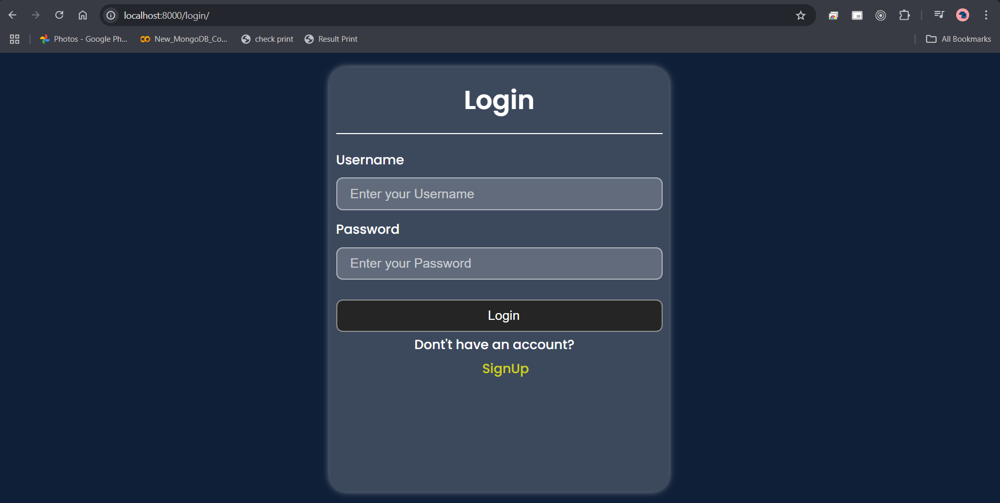
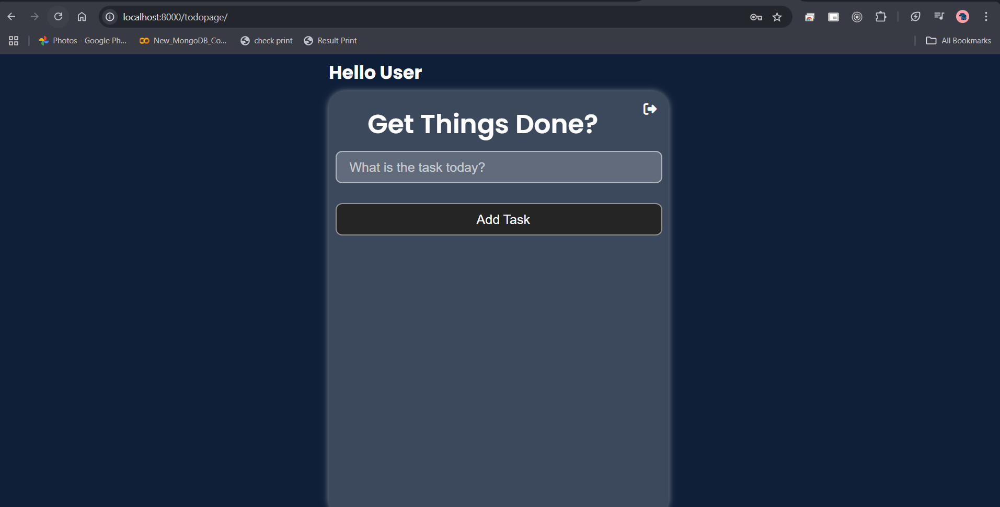
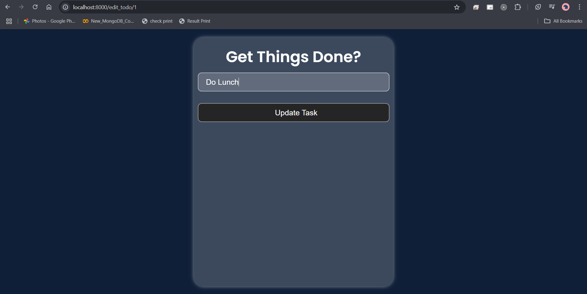

# Todo App

A sleek and modern Todo application built with Django that helps users organize their daily tasks efficiently with a beautiful user interface and secure authentication system.

## 🎯 Live Demo

🔗 [Try Todo Manager](url)

## 🔍 Features

* 🔐 Secure user authentication system
* ✨ Clean and intuitive UI design
* 📝 CRUD operations for tasks
* 🎨 Responsive design using modern CSS
* ⚡ Real-time task updates

## 📸 Preview

### 🔹 SignUp Page


### 🔹 Login Page



### 🔹 Task Dashboard




### 🔹 Task Management



## 🛠️ Technologies Used

* **Frontend:**
  * HTML5
  * CSS3
  * JavaScript
  * Font Awesome Icons
  * Google Fonts (Poppins)

* **Backend:**
  * Django 5.2
  * SQLite3
  * Python 3.12.0

## 🚀 Quick Start

```bash
# Clone the repository
git clone https://github.com/sarbeswarbhol/Todo-app.git

# Navigate to project
cd Todo-app

# Create virtual environment
python -m venv venv

# Activate virtual environment
.\venv\Scripts\activate

# Install dependencies
pip install -r requirements.txt

# Run migrations
python manage.py migrate

# Start server
python manage.py runserver
```

## 📁 Project Structure

```
Todo-app/
├── todoapp/           # Main application
├── templates/         # HTML templates
│   ├── login.html
│   ├── signup.html
│   └── edit_todo.html
├── static/           # Static assets
│   ├── css/
│   └── js/
└── manage.py
```